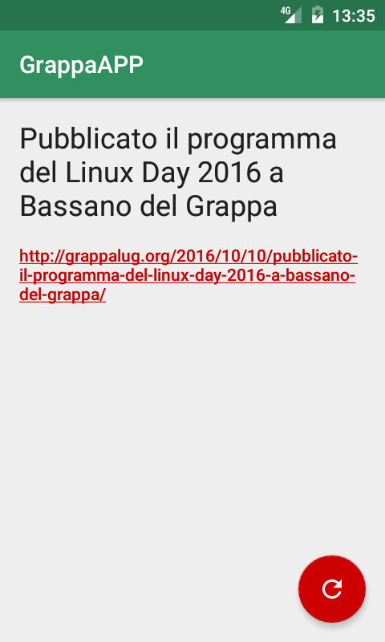

# GrappaAPP

*The following description is written in Italian.*

GrappaAPP è una semplice applicazione di esempio, legata al mio talk *Come si
creano le app Android* presentato al [Linux Day 2016 a Bassano del Grappa
(VI)][1] il 22 ottobre 2016.

Questa app è intenzionalmente minimale e ha l'unico scopo di mostrare in pratica
i principali temi discussi durante il talk. In particolare, implementa:

- una singola `Activity`
- material design
- aspetto corretto (con ombra) per la `ActionBar` anche su dispositivi più
  vecchi
- gestione dell'*instance state* alla rotazione dello schermo
- un'icona vettoriale
- permesso per l'uso di Internet nel *Manifest*
- connessione alla rete tramite un `AsyncTask`
- gestione del "click" su un bottone

Il codice è commentato nei punti principali per renderne più facile la
comprensione. Questo piccolo esempio è rilasciato nel pubblico dominio (si veda
il file [LICENSE][2]), tuttavia l'icona con il pinguino è di proprietà
del [GrappaLUG][3].

Questo è solamente un esempio banale, non inteso per il rilascio in forma
binaria. Tuttavia, quando si usano librerie come la Google Support Library e
tante altre, è sempre opportuno ricordarsi di indicarle in un'apposita schermata
come prevedono le varie licenze open source.

Il **pacchetto APK** di debug [si trova qui][4].

  [1]: http://grappalug.org/linux-day/linux-day-2016/
  [2]: LICENSE
  [3]: http://grappalug.org
  [4]: GrappaAPP/app/build/outputs/apk/app-debug,apk
